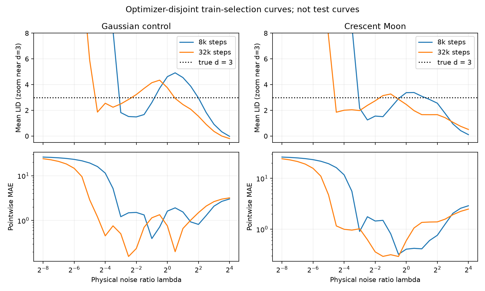

# Новый VP-baseline и честное сравнение семейств

Рабочая спецификация для следующего прогона. 5 сентября 2026.

## Зачем это меняем

Нам нужен содержательный FLIPD-baseline, а не точная реконструкция недоступного
fork. Сохраняем данные benchmark, тип diffusion-архитектуры, VP-процесс и
score-matching objective из доступного кода. Ширину сети и бюджет выбираем сами,
проверяем обучение и явно описываем этот выбор. Не заявляем воспроизведение
опубликованных чисел один в один.

В старой таблице diffusion — **VE x0-denoiser**, а не VP. Старые результаты и
checkpoint'ы остаются VE. Переименование их в FLIPD/VP недопустимо: нужен новый
прогон с отдельным scientific identity.

Дополнение по решению автора: в новой кампании сохраняем **обе diffusion
строки, VP и VE**. На known-LID публикуем два протокола из одного checkpoint:
supervised held-out-train MAE selection и label-free Kneedle из доступного
FLIPD-кода. Эти варианты подключены в отдельном versioned v2 runner; ниже
зафиксированы его научный контракт и границы интерпретации.

Что уже есть в этом изменении:

- `models/vp_baseline.py`: VP schedule, уменьшенный bottleneck MLP, objective,
  denoiser и экспорт score/divergence. Формула LID переиспользуется из
  `models/readouts.py`, trace — из `models/neural_fields.py`.
- `experiments/vp_baseline_pilot.py` и `configs/vp_baseline_pilot.yaml`: маленький
  Hydra-пилот с train-selection holdout, сохранением checkpoint'ов, предсказаний
  и хэшей. Это не новый runner всей кампании.
- Unit/integration tests: знаки, координаты, аналитический Gaussian, trace,
  архитектура, checkpoint roundtrip, отсутствие optimizer/selector overlap,
  отказ от test при граничном выборе, проверка хэшей и запрет overwrite.
- `datasets/vp_pilot.py` содержит только две переносимые pilot fixtures;
  старые локальные `ve_*` скрипты для запуска нового пилота не нужны.

Полный v2 benchmark в этом commit ещё не завершён. Реализация вынесена в
`experiments/global_campaign_v2.py`, `experiments/global_parallel_v2.py` и
`experiments/v2_canary.py`; исторический v1 runner и его запечатанные результаты
не переименовываются и не перезаписываются.

Проверенные в pilot-отчёте численные строки ниже следует считать только
исторической диагностикой. В переданном commit три producing-source SHA из
`docs/results/vp_pilot_20260905.json` не совпадают с файлами того же Git tree:
`models/vp_baseline.py`, `models/training.py` и
`experiments/vp_baseline_pilot.py`; ещё один указанный source-файл отсутствует.
Поэтому JSON и PNG не являются provenance-валидным результатом нового v2
прогона и не используются как его вход или acceptance evidence.

## 1. Данные и разбиения

Использовать **опубликованный архив**, а не заново запускать генератор:

```bash
uv sync --frozen --extra train --group dev
uv run lid-benchmarks-data verify --archive data/benchmarks.zip
uv run lid-benchmarks-data extract \
  --archive data/benchmarks.zip \
  --destination data/lid_benchmarks_exact
```

Ожидаемый SHA-256 архива:
`ce0d153a1a78a3a752b29ec2e60167134b6b20c3249db2fe92f9fc1b8b8a9181`.
Registry: `configs/datasets/registry/paper_benchmarks.yaml`. Не менять сами
архивные `.npy`. Существующие проверки и in-memory исправления LID сохранить:
Spaghetti — 1, Funnel — 2, Crescent Moon — 3, архивные Spheres — 5.
Название `sphere4` здесь обманчиво: артефакт содержит S5, а не S4.

Для известных размерностей benchmark обычно даёт 100000/1000/1000 объектов;
Arrows — 100000/10000/10000. Это размеры исходных split'ов, не число примеров,
которые реально попали в optimizer.

Сохранить существующую детерминированную границу `optimizer-fit` /
`train-selection`: `splitmix64_rank_v1`, fraction 0.2, maximum 1000,
minimum selection 2, minimum fit 8. Одинаковые индексы для всех моделей одной
dataset/representation cell. Нельзя одним моделям отдать весь train, а другим
вычесть holdout. Для маленьких E1 явно записывать и исходный N, и фактический
N_fit: например, 12 исходных объектов не означают 12 optimizer-объектов.

На `train-selection` разрешены native loss для выбора checkpoint и LID для
выбора масштаба. Эта часть не участвует в optimizer. Benchmark validation/test
не используются для настройки масштаба; в основном протоколе обращаемся к ним
после его фиксации. Это **наш supervised held-out протокол**, а не upstream
выбор по test MAE. Он общий для семейств и не даёт FLIPD меньше информации,
чем конкурентам.

В названии нового supervised track «validation» означает этот существующий
optimizer-disjoint `train-selection`, а не незаметное переназначение архивного
`val`. Native loss выбирает checkpoint до обоих LID-протоколов. Kneedle не
получает ground-truth LID и не меняет checkpoint; подробности в Section 6.

Generated E3/E4, если сохраняем их в матрице, имеют отдельное происхождение и
используют уже существующий `datasets.generated_e3_e4`. Не смешивать их с
каноническими данными в описании воспроизведения.

### Sample-size, transformations, Arrows

- **Sample-size / E1:** 13 FMNIST train sizes от 50000 до 12; одинаковые
  validation/test ряды у вариантов проверить по хэшам. Reference — step1.
  Сохранять отдельную кривую оценки LID против N, а не только средний score.
- **Transformations / E5:** ME — степени 0.25 и 4; ASE — upscaling; ADI —
  добавление 0/4/8 факторов. Ожидаемая разность LID равна 0 для ME/ASE и k
  для ADI. Использовать правильный reference из registry, включая downscaled
  control; не сравнивать всё с произвольным FMNIST. Проверять порядок рядов и
  соответствие transform/reference; совпадение class labels само по себе не
  доказывает корректную попарную привязку.
- **Arrows:** использовать исходные изображения и construction label 6k.
  Не чинить renderer с одновременным сохранением старого dataset ID. Перед
  запуском проверить RGB/layout, dtype, диапазон значений, несколько изображений
  и масштаб после preprocessing. Квантизация/перекрытия — отдельная оговорка
  этого benchmark, а не повод приписать ошибку только diffusion. До прохождения
  data gate не возвращать Arrows в headline known-LID aggregate. Даже после
  gate показывать его отдельно от аналитических многообразий.

## 2. Preprocessing: одна явная система координат

Для нового контролируемого сравнения оставить train-fit mean + **один общий
scalar RMS**, как в текущем trainer:

\[
\mu=\frac1N\sum_i x_i,\qquad
c^2=\frac1{ND}\sum_i\|x_i-\mu\|^2,\qquad
\widetilde x=(x-\mu)/c.
\]

Одинаковые `mu`, `c` и hashes для всех семейств одной cell. На holdout/test
их не переоценивать. Не делать per-coordinate whitening, clipping или
деквантизацию только для одной модели. Не складывать скрытую нормализацию
внутри модели с отдельным transform в loader.

Это намеренный общий preprocessing, а не притворное копирование FLIPD.
В доступном image-конфиге FLIPD используется fixed Normalize(0.5, 0.5), то
есть для RGB после ToTensor — [-1,1]. Общий RMS оставляем, чтобы не гадать об
обработке нестандартных benchmark arrays и иметь сопоставимые масштабы внутри
нашего сравнения. Изменение явно указать в appendix.

Все lambda ниже заданы после этого преобразования. В исходных единицах
эффективный шум равен `c * lambda`. Значения номинального VP-time и VE-sigma
сравнивать напрямую нельзя.

## 3. VP-baseline: процесс, сеть, loss, readout

На вход модели подаётся

\[
Y_t=a(t)\widetilde X+s(t)Z,\quad Z\sim N(0,I),\quad
B(t)=0.1t+\tfrac12(20-0.1)t^2,
\]
\[
a(t)=e^{-B(t)/2},\qquad s(t)=\sqrt{1-e^{-B(t)}},\qquad
\lambda(t)=s(t)/a(t).
\]

В тренировке `t ~ Uniform[0,1)`, независимо от примера и Z. Здесь 20 —
**конечное значение** beta, не её наклон. При t=1, a≈0.00657 и lambda≈152:
это совсем другой диапазон, чем старый VE с sigma_max=1.

Сеть возвращает **negative noise** `h_theta(Y_t,t)`, target = `-Z`:

\[
L=\mathbb E\sum_{j=1}^{D}(h_{\theta,j}(Y_t,t)+Z_j)^2.
\]

Это то, что делает доступный `LightningDiffusion.loss`. В таблице самой
FLIPD-статьи написано likelihood weighting; не смешивать два варианта.
Наш выбор — исполняемый negative-noise MSE из кода. В manifests записать
feature-sum reduction: переход к feature-mean меняет gradient units и не
должен происходить молча. Для графиков loss можно дополнительно делить на D.
Не подменять target x0 и не добавлять EDM-preconditioning в этот baseline.

Архитектура — fully connected U-shaped MLP с SiLU и concatenative skips,
sin/cos embedding native time размерности 128. Encoder widths:

```yaml
hidden_sizes: [1024, 512, 256, 256, 128, 128]
time_dim: 128
```

Decoder зеркальный; output не обнуляется. Это четверть исходных hidden widths
FLIPD [4096,2048,1024,1024,512,512], но тот же тип сети. Размеры проверены
подсчётом параметров, а не приблизительным сравнением hidden_dim:

| Ambient D | Параметров в новом MLP |
|---:|---:|
| 30 | 3 200 034 |
| 256 | 3 756 672 |
| 784 | 5 455 248 |
| 1024 | 6 411 648 |
| 3072 | 19 258 752 |

Для FLIPD в **чистой** точке x нужно вычислять сеть в y=a(t)x, не в x и не
в случайно зашумлённой x. Score и denoiser:

\[
q_\theta(y,t)=h_\theta(y,t)/s(t),\qquad
\widehat x_0(y,t)=\frac{y+s(t)h_\theta(y,t)}{a(t)}.
\]

Далее использовать существующую формулу `diffusion_flipd`:

\[
\widehat d=D+s^2\{\operatorname{div}_y q_\theta+\|q_\theta\|^2\}
=D+s\operatorname{div}_y h_\theta+\|h_\theta\|^2.
\]

Divergence берётся по native input y. При дифференцировании композиции
`model(a*x,t)` по x получится дополнительный a — это другая величина.
В `diffusion_flipd(..., sigma=...)` передавать s(t), **не lambda**.

### Дополнительная VE-строка

VE остаётся отдельной моделью нового сравнения, а не только историческим
артефактом. Сохранить текущий x0-target, log-uniform sigma sampling,
`diffusion_loss_weighting=sigma_squared_score` и
`diffusion_preconditioning=none`. Не включать EDM автоматически и не
переименовывать log-noise FM в VE, даже когда их population formulas совпадают.

К VE применяются общий reduced backbone, бюджет, preprocessing и новый train
support `sigma=lambda` от 1/256 до 64. Поэтому это новое обучение с отдельным
ID. Старый checkpoint с sigma_max=1 нельзя использовать для этой строки на
расширенной сетке. Исторические конфиги и результаты сохранить без изменений.

## 4. Остальные модели: что выравниваем, что не трогаем

Все vector-field модели получают такой же bottleneck backbone и те же widths,
поэтому в одной cell имеют одинаковое число параметров. Conditioning coordinate
остаётся частью конкретного метода. Три controlled posterior FM должны
сохранять общий `log(lambda)` conditioning и тот же embedding между собой.

Не приводить все семейства к одному training loss. Это уничтожило бы смысл
сравнения разных способов обучения. В частности:

| Семейство | Сохранить |
|---|---|
| VP/FLIPD | uniform native t, negative-noise MSE выше |
| VE diffusion | существующий x0-denoising objective, log-uniform sigma, без EDM |
| Native rectified flow | independent Gaussian source, native t и velocity target X−Z |
| Controlled affine FM, direct/posterior | контракты `affine_flow.py`: log-uniform lambda, общий conditioning, соответствующий target и posterior-bias-equivalent units |
| Brownian bridge control | существующий terminal-data/Lebesgue Gaussian-smoothing contract и его native loss |
| Scale-conditioned NF | conditional Gaussian-smoothed likelihood, native NLL |

Уже согласованные FM objectives заново перевзвешивать не надо. Популяционная
эквивалентность posterior log-noise FM и VE остаётся полезным regression test.
VP trigonometric FM не переименовывать в VP diffusion: это разные learning
recipes, даже когда при согласованном lambda совпадает Gaussian channel.

Основное сравнение full readout — с full FLIPD. Response и fm_to_score из того
же checkpoint — связанные дополнительные readouts. Сначала выбрать lambda по
primary full, затем показать остальные в той же точке: так разницу формул не
путаем с дополнительным подбором масштаба. Если нужен отдельно tuned response,
это явно другая selection row, а не ещё одна независимо обученная модель.

### Что делать с NF

В benchmark **LIDL** использует MAF и отдельные density fits для delta-triplets.
Наш conditional RealNVP — не эта реализация LIDL. Сохранять его в сравнении
можно как **наш scale-conditioned NF interface**, но нельзя назвать такую
строку reproduced LIDL baseline. Для текущего вопроса не добавляем дорогое
семейство из множества независимых LIDL fits.

Оставить 8 coupling layers, conditioner depth 2, context dimension 128,
log_scale_limit=2 и exact likelihood. Подбирать только conditioner width по
числу параметров: ближайший multiple of 32 к размеру MLP данной cell, до
обучения и без просмотра метрик. Уже рассчитанные значения:

| D | NF hidden_dim | NF параметров | Отличие от MLP |
|---:|---:|---:|---:|
| 30 | 544 | 3 154 288 | −1.4% |
| 256 | 480 | 3 843 968 | +2.3% |
| 784 | 384 | 5 222 912 | −4.3% |
| 1024 | 384 | 6 330 752 | −1.3% |
| 3072 | 448 | 18 636 160 | −3.2% |

Для прочих D пересчитать, допустимый зазор ±10%. Это выравнивание capacity,
не утверждение о равенстве FLOPs или expressivity. Сохранять wall time тоже.

Если всё-таки добавляем настоящий LIDL-reference: MAF, 5 transforms
(4 для original-manifold+padding в benchmark), `hidden=5` в official code
означает **5D hidden features**, не пять нейронов. Delta-triplets —
(2^{−(n−1)},2^{−n},2^{−(n+1)}), n=1..7. Это отдельный, явно посчитанный
training budget; не встраивать его незаметно в один NF checkpoint.

## 5. Бюджет обучения и защита от underfitting

Основная единица бюджета — число предъявлений training examples, а не epochs.
При sampling with replacement все модели видят одинаковый поток data indices
и **независимые corruption draws** согласно своему objective. Повторные
предъявления считаются в бюджет; уникальные объекты считать отдельно.

Для полного прогона стартовая рекомендация:

```yaml
batch_size: 256
steps: 32000
examples_seen: 8192000
early_stopping: false
validation_interval_steps: 500
model_seed: 0
```

Эта рекомендация требует короткого image-space canary перед всей матрицей;
не переносить скорость/качество D=30 на Arrows или IDR без проверки.
32k — инженерный выбор бюджета, не восстановленный параметр benchmark.

VP: AdamW, lr=1e-4, weight_decay=0.01, 500 warmup steps, затем cosine decay;
scheduler вызывается **каждый optimizer step**, не раз в epoch. Без EMA,
dropout, скрытого weight averaging, gradient clipping и AMP в стартовом
диагностическом конфиге. FP32, TF32 отключён до derivative sanity check.
Остальным семействам оставить их native optimizer/loss recipe из текущих YAML;
не сравнивать численные значения разных native losses между собой.

Сохранить оба checkpoint: final и best по target-free train-selection loss.
Для протокола, близкого benchmark, primary — best внутри одинакового
предоставленного бюджета. **Это равный бюджет обучения, но не обязательно
равное число примеров до выбранных весов.** Обязательно публиковать
`examples_seen_total` и `examples_seen_at_selected_checkpoint`. Если требование
равенства относится буквально к возвращённым весам, использовать final для
всех, с отдельным versioned protocol ID; не смешивать два варианта в таблице.
В локальном пилоте ниже проверен именно validation-best вариант.

Для E1 fixed steps особенно важны: 200 epochs на 12 и на 50000 объектах —
радикально разные compute budgets. Это не исправляется общим batch size.
Fixed examples-seen отделяет нехватку уникальных данных от нехватки updates.

### Что считать достаточным качеством перед full launch

Проверить VP и хотя бы один FM на одном аналитическом коэффициентном наборе и
одном IDR image наборе, NF — на том же image наборе. Не запускать seed sweep.

Смотреть не только общий loss:

1. Native held-out loss finite, упал и не продолжает быстро улучшаться на
   последней части бюджета. Если checkpoint всё время последний — посмотреть
   наклон, это само по себе ещё не доказательство underfitting.
2. На held-out noisy inputs при нескольких lambda восстановить x0. Сравнить
   MSE с `Y/a` и train mean, показать clean/noisy/denoised проекции или картинки.
   При умеренном шуме должно быть заметное улучшение; большие lambda могут
   честно приближаться к прогнозу средним, поскольку информации уже нет.
3. В известной размерности посмотреть **pointwise MAE**, а не только среднее
   LID. Хороший denoising loss не контролирует ошибку Jacobian автоматически.
4. Для NF проверить held-out NLL по scale bins и относительно простого
   Gaussian density reference; native NLL напрямую не сравнивать с DSM MSE.
5. Если есть явный underfit, один парный retry с большим бюджетом на том же
   canary. Заморозить новую общую величину бюджета до full test, а не лечить
   только проигравшие модели после просмотра таблицы.

Это learning gates, не гарантии отсутствия вопросов reviewer'а и не теорема
о качестве LID. Если выбранное семейство не проходит gate, сохранить failed
status и причину; не усреднять только удачные cells как полную матрицу.

## 6. Масштабы: убрать искусственную границу sigma=1

Внешняя координата **для всех** — lambda в model space. Native conversion:

| Модель | Координата внутри |
|---|---|
| VP | t решает B(t)=log(1+lambda²) |
| VE / log-noise | sigma=lambda |
| Rectified X_t=tX+(1−t)Z | t=1/(1+lambda) |
| Affine FM | существующий inverse schedule(lambda) |
| Brownian gamma=1 | tau=lambda² |
| Conditional NF | epsilon=lambda |

Рекомендуемый train support у VE и scale-conditioned FM/NF/bridge:
lambda ∈ [1/256,64]. У VP полный t∈[0,1) уже покрывает это; у native RF
проверить t_min/t_max и endpoints. Для bridge с gamma=1 это означает
T=4096, tau∈[1/65536,4096], а не старое T=1. Это всё ещё тот же
Gaussian-smoothing bridge **control**, не новый entropic transport experiment.

Это не обучение на всех положительных масштабах. При нашем VP schedule
native sigma(t) меньше 1, а lambda=sigma/alpha достигает около 152.167 при
t=1: величина большая, но конечная. Общий интервал [1/256,64] соответствует
VP-time примерно [0.000150338,0.909309]; у rectified flow — native time
[1/65,256/257]. У VE/NF/bridge границы задаются явно.

Обязательное правило full runner: **все фактические запросы estimator должны
лежать внутри train support checkpoint**, после преобразования координат.
Проверять не только YAML перед запуском, но и загруженный training contract;
каждый кандидат, расширение сетки и весь NF OLS stencil проходят эту проверку.
Вне диапазона — явная ошибка/unsupported status, без clipping и экстраполяции.
Если support расширяется, нужен новый training run, а не подмена metadata.

Попадание в support не гарантирует хорошего обучения. При непрерывном sampling
нужна экспозиция в окрестности масштаба, не буквальное повторение того же
float. Сохранять counts и native validation losses по общим log-lambda bins;
разные native sampling laws остаются частью методов. Особенно проверить
малые VP-time и края диапазона. Плохое качество внутри диапазона — learning
failure, а не повод объявить поддержку диапазона доказательством точности.

### Known LID: два заранее зафиксированных протокола

**A. Validation MAE.** Один глобальный масштаб для dataset/representation cell
выбирается на optimizer-disjoint `train-selection`. Затем оценивается test.
Checkpoint общий с протоколом B и выбран заранее по native held-out loss.

Для known-LID начать с lambda=2^{k/2}, k=−12..8: 21 кандидат от 1/64 до 16.
Scale selection — минимум train-selection MAE, tie tolerance 1e-12 и меньшая
lambda при равенстве. Raw native-time tie break здесь не использовать.

Если выбран первый/последний кандидат:

1. Расширить именно train-selection curve в соответствующую сторону тем же
   шагом, максимум до [1/256,64]. Checkpoint не меняется; test не читается.
2. Сохранить каждый просмотренный кандидат и все pointwise predictions.
3. Если optimum всё ещё крайний, записать `scale_unresolved`; это не
   «оптимальная sigma найдена». Не extrapolate за training support и не
   заставлять selector брать соседнюю внутреннюю точку только ради галочки.

Расширение evaluation без расширения train support не чинит старую модель.
Для NF OLS5 весь заранее заданный stencil также обязан лежать внутри train
support. Пять likelihood evaluations фиксированного readout — не пять
попыток выбрать sigma на test. Autograd/OLS5 — связанные readouts одного NF.

**B. FLIPD-code Kneedle.** Перенести именно исполняемую функцию
`lid/utils.py::compute_knee` из FLIPD revision
`05ab170c2c9bcada3f9286c3ef86db31b80925fa`, а не прежнюю свободную
«benchmark-inspired» эвристику. Зафиксировать версию kneed при реализации и
проверить эквивалентность на одинаковых входных кривых. В этом source snapshot:

- функция оставляет строго 0.05 < t < 0.5, вызывает decreasing/convex Kneedle
  с S=1 и при отсутствии knee возвращает D;
- несмотря на docstring, convex_hull внутри этой функции не вызывается;
- callback задаёт исходную сетку `linspace(0,1,50)`. Для selector достаточно
  вычислить её 22 точки после указанного фильтра; остальные точки на выход
  функции не влияют. Не заменять эту сетку 50 точками нового интервала.

Для переноса на семейства используем те же t_j как координату **эталонного VP**
с beta endpoints 0.1/20, переводим их в lambda_j и лишь затем в native
координату модели. Эти выбранные lambda_j находятся внутри общего support.
Это явное cross-family преобразование, а не применение численно одинакового
native time к VE, VP, RF и NF.

Фиксируем pointwise wrapper: одна индивидуальная primary LID curve каждого
query подаётся в функцию; ground-truth LID добавляется только при расчёте
итоговой MAE. Для полей primary — full, для NF — объявленный основной
fixed-likelihood readout. Не заменять эти кривые средней по датасету молча:
это другой, global reference selector. Сохранить lambda_hat(x), итоговую
оценку и статус. No-knee fallback D включается в MAE, а его доля показывается
отдельно; исключать такие queries из таблицы нельзя. Нефинитные входные
кривые требуют отдельного failed status, не скрытого удаления точек.

Граница точности заявления: это воспроизведение доступной функции и явно
зафиксированного wrapper, не восстановленный исторический evaluation script.
Исходная FLIPD-статья описывает 50-scale Kneedle; benchmark Appendix F отдельно
говорит о test-MAE для known LID и модификации по максимуму средней кривой
для unknown LID. Эти три вещи не называть одним «точным benchmark setup».
Прежний modified reference selector остаётся только в E1/E5 ниже.

### Что можно сделать post-hoc

Обучать отдельную модель для A и B не нужно. Сначала фиксируем checkpoint,
readout, grid, preprocessing, trace draws и обе selector recipes. Затем
сохраняем pointwise curves с query IDs и physical scales. A использует
selection labels; B — индивидуальные query curves без labels. Test targets
не участвуют в выборе параметров B или в сравнении его вариантов.

Если необходимые массивы уже сохранены, оба результата вычисляются post-hoc
без модели. Если сохранена только средняя кривая или только один выбранный
test-scale, нужны дополнительные model/derivative evaluations, но не retraining.
Можно сохранить объединение сеток с идентификаторами, какая часть нужна A/B;
Kneedle передаётся только его исходная под-сетка. Не выбирать лучший selector
после test: публикуем обе заранее объявленные колонки, включая failures.

Пилот Section 8 сохранял selection curves и test лишь на одном выбранном
масштабе. Его новые Kneedle-результаты нельзя получить только из текущего JSON;
понадобится дооценка сохранённых checkpoints. Здесь она не запускалась.

### Unknown LID: E1/E5 — отдельная проблема

Нельзя выбирать lambda, минимизируя E1/E5 test score или ожидаемую ADI-разницу.
У benchmark здесь модифицированный Kneedle, у текущего runner — global
reference stability. Они не эквивалентны. После расширения сетки последний
особенно опасен: почти нулевая оценка у prior тоже выглядит очень стабильной.
Не переносить старый `select_stable_scale` на [1/256,64] без изменений.

Для следующего прогона рекомендуемый reference-selector — benchmark-inspired
Kneedle с заранее фиксированными настройками: `curve=convex`,
`direction=decreasing`, `S=1`, `online=False`, interpolation `interp1d`.
На reference train-selection усреднить full LID, отбросить часть до global
maximum средней кривой, искать первое оставшееся knee. Для всех семейств
использовать **общую VP-time координату** t_VP(lambda) с beta endpoints 0.1/20,
а не их несопоставимые native times. Для этого reference-прохода использовать
50 равномерных t между t_VP(1/256) и t_VP(64), конвертировать обратно в lambda;
те же кандидаты и probe draws для семейств. Так не объявляем выбор по
log(lambda) точным повторением upstream Kneedle по t.

Нет knee, оно на краю или remaining segment слишком короткий — явный
`selection_failed`, без замены на prior plateau или supervised ADI tuning.
Это практическая эвристика; её пригодность для FM/NF ещё нужно проверить на
reference canary, не выдавать её за новый доказанный автоматический метод.

Для E1 выбрать lambda **один раз на step1 reference**, затем переиспользовать
тот же physical lambda для всех sample sizes. Для E5 — один раз на правильном
reference каждой transformation family, затем тот же lambda у вариантов.
Не выбирать разные времена так, чтобы paired delta получилась красивой.
Описывать этот reference-selector отдельно от supervised known-LID selection.

## 7. Trace, проверки и артефакты

В small-D canary — exact trace. Для image-space начать с 16 Rademacher probes,
общих между сравниваемыми readouts и масштабами. До full test на небольшом
train-selection subset сравнить 16/64 и, где посильно, exact. Если расхождение
сопоставимо с различиями методов, увеличить число probes для всего paired
сравнения этой cell. FP64 accumulation формулы не исправляет неточный FP32
Jacobian: на small subset проверить и precision самой дифференциации.

Сохранить existing boundaries из `docs/ARCHITECTURE.md`: data → preprocessing
→ model primitives → `models.readouts` → metrics → sealed artifacts. Все
настройки только Hydra/YAML. Приватные credentials в конфиги не добавлять.

Новая campaign version должна иметь отдельный ID, VP family и output root.
Не ослаблять проверки старых allowlists, не пересчитывать старый
checkpoint как новый VP и не переиспользовать старый cache по похожему имени.
Для длительного cluster run сохранить существующий atomic progress/resume:
optimizer, scheduler/global step, RNG, sampler state, counters, best state.
Тест resumed-vs-uninterrupted обязателен после перехода от epochs к steps.

В каждой cell нужны: resolved config и overrides, source hashes, raw data и
preprocessing identities, split indices, parameter count, examples/steps до
best/final, native loss history, quality diagnostics, полная selection curve,
frozen choice, test pointwise predictions и targets, trace metadata, статусы
gates и хэши outputs. Test curves не использовать для supervised настройки.
Для заранее фиксированного pointwise Kneedle сохранять query curves без
доступа selector к test targets; target-free inference не является test-MAE
тюнингом. Сохранять отдельные protocol IDs и cost для обоих вариантов.
Общие таблицы пересчитать из pointwise arrays, сохранив раздельно coefficient,
IDR, Arrows, sample-size и transformations. E1/E5 — не MAE к известному LID.

## 8. Локальная проверка и команды

Пилот использует 32768 source-train объектов, из них 1024 optimizer-disjoint
train-selection, и по 1024 validation/test. D=30. Gaussian control имеет
точную размерность 3; Crescent Moon — regenerated coefficient geometry из
проверенного pinned generator, effective LID 3. Ни один набор здесь не
подменяет canonical benchmark archive.

```bash
uv run python -m experiments.vp_baseline_pilot --cfg job
uv run python -m experiments.vp_baseline_pilot \
  dataset=rank3_gaussian_control device=cuda:0
uv run python -m experiments.vp_baseline_pilot \
  dataset=e7_crescent_moon_radius3.0 device=cuda:0

# Один budget diagnostic, а не seed sweep. Новый output root обязателен.
uv run python -m experiments.vp_baseline_pilot \
  dataset=rank3_gaussian_control device=cuda:0 \
  training.steps=32000 output_root=artifacts/vp_baseline_budget_check

uv run pytest tests/unit/test_vp_baseline.py \
  tests/integration/test_vp_baseline_pilot.py
```

Повтор запуска в существующий output directory отклоняется. Этот короткий
пилот не поддерживает resume и не является replacement для cluster runner.
Локальный logging — файловый, без Comet. Production logging/resume берём из
существующего pipeline, а не копируем упрощённый pilot trainer целиком.

Измеренные результаты 8000 steps × 256 = 2048000 предъявлений:

| Набор, d=3 | Native held-out loss: initial → best | Выбранная lambda | Test LID MAE | Mean test LID |
|---|---:|---:|---:|---:|
| Gaussian control | 30.757 → 1.744 | 0.5 | 0.3952 | 2.6048 |
| Crescent Moon | 30.794 → 1.494 | 0.7071 | 0.3158 | 2.9063 |

Оба выбора внутренние, finite fraction=1. При lambda=0.5 reconstruction MSE
относительно noisy-input reference составляет 0.0977 и 0.0808 соответственно.
Обучение каждой модели заняло около 50 секунд на одной A100 80GB, около 56
секунд вместе с оценкой; это измерение для D=30, не ETA всей кампании.

При 32000 steps × 256 = 8192000 предъявлений, с той же архитектурой и seed:

| Набор, d=3 | Best native loss | Выбранная lambda | Test LID MAE | Mean test LID |
|---|---:|---:|---:|---:|
| Gaussian control | 1.5486 | 0.1768 | 0.1645 | 2.8434 |
| Crescent Moon | 1.2064 | 0.7071 | 0.2765 | 2.8512 |

Оба выбора снова внутренние; все predictions finite. Training занял примерно
215–218 секунд на модель. Лучшие checkpoints выбраны на 31000 и 30000 steps,
то есть после 7936000 и 7680000 предъявлений, а не после полного бюджета.

Вывод скромный, но полезный: VP-код работает, и увеличение training budget
помогло Gaussian LID сильнее, чем это видно по общей denoising MSE. Остаточный
bias остаётся; успешная реконструкция не доказывает точность производных.
На selection curves видны провалы и подъёмы, а не широкое ровное плато d=3.
Поэтому внутренний MAE-optimum нельзя автоматически назвать надёжно найденным
плато: он подтверждён здесь supervised holdout, но не label-free selector'ом.
Это **exploratory budget check** на тех же pilot datasets, не четыре
независимых подтверждения. Изменился и горизонт cosine schedule, поэтому
нельзя приписать весь эффект исключительно числу шагов при фиксированной LR
траектории. Изображения, NF, FM и E1/E5 в этом пилоте не обучались.



График показывает train-selection, не test curves; верхний ряд увеличен в
окрестности d=3. Полные mean/MAE curves и pointwise arrays лежат в run artifacts.
[Машиночитаемый результат](results/vp_pilot_20260905.json) содержит producing
source hashes, полные настройки и measured summaries. Проверены хэши всех
outputs, разбиения, preprocessing, выбор lambda и MAE из исходных predictions.
После удаления зависимости от старого локального sampler дополнительно
проверено побитовое совпадение заново полученных входных массивов.

Повторная проверка артефактов (когда четыре локальных run directory доступны):

```bash
uv sync --frozen --extra train --extra upstream --group dev
uv run python -m experiments.vp_pilot_audit
```

Extra `upstream` здесь нужен для matplotlib при построении PNG. Сам VP-пилот
не импортирует upstream training code и работает с extra `train`.

Первая проверка кода в исходном рабочем дереве — **455 passed**; lint и форматирование
семи новых Python-файлов также прошли. В тестах есть CPU training smoke,
аналитические проверки VP/readout и обнаружение Hydra YAML через CLI.
Первый wheel build упал из-за локального uv cache (`Invalid cross-device link`);
повтор полного набора с отдельным `UV_CACHE_DIR` прошёл. Это проверка реализации,
а не свидетельство сходимости ещё не запущенных image-space моделей.

Перед публикацией отдельно проверена чистая рабочая копия базового commit
с только двенадцатью файлами этого handoff: **438 passed**. Разница в числе
тестов связана с исключением посторонних локальных изменений, а не с
пропуском тестов; imports подтверждены из чистой копии, lint/format прошли.

В Git передаём код, YAML, этот документ, небольшой JSON report и PNG.
Большие training artifacts/checkpoints остаются в ignored `artifacts/`;
коллега может повторить пилот приведёнными командами.

## 9. Статус production-реализации v2

На 6 сентября 2026 кодом зафиксирован следующий отдельный контур:

1. Матрица содержит 11 физических вариантов и 39 cells на вариант:
   35 canonical и 4 generated E3/E4, всего 429 независимых обучений.
2. Все vector-field family используют bottleneck
   `[1024, 512, 256, 256, 128, 128]`; ширина conditional RealNVP выбирается
   детерминированно по ambient dimension с допуском 10% по parameter count.
3. Бюджет равен 32000 optimizer steps при batch 256 без early stopping.
   VP использует AdamW, `lr=1e-4`, `weight_decay=0.01`, 500-step warmup и
   cosine decay; остальные семейства сохраняют свой объявленный native loss и
   используют `lr=2e-4`, `weight_decay=1e-6`.
4. Поддержка физической lambda общая: `[1/256, 64]`. У NF training epsilon
   расширена ровно на `exp(±0.1)`, чтобы пятиточечный OLS5 stencil оставался
   внутри support даже в крайних evaluation-точках; это не расширяет диапазон
   выбора масштаба.
5. Known-LID сохраняет supervised held-out-train selector и точный перенос
   pointwise FLIPD Kneedle с ambient-dimension fallback. E1/E5 используют
   target-free reference-mean Kneedle; отсутствие внутреннего knee запечатывает
   `selection_failed` без surrogate scale и без выдуманных метрик.
6. Один 8-H100 cell-DAG запускает по одному независимому worker на GPU. Перед
   оставшимися cells обязательны data gate и восемь полноразмерных production
   canary cells (VP, VE, один posterior FM и NF на D=30 и Arrows D=3072). Эти
   восемь cells входят в 429 и затем переиспользуются, а не обучаются повторно.
7. Для FM cells с ambient dimension не выше 64 сохраняются exact trace и
   empirical oracle. Для D=256/784/1024/3072 применяется отдельно названная
   Hutchinson-16/64 prefix-stability проверка без заявления exact/oracle.
8. Evaluation выполняется и checkpoint удаляется внутри каждой cell до seal.
   В full DAG stable incomplete directory и progress checkpoint обеспечивают
   deterministic resume. Canary намеренно строже: незапечатанное обучение с
   существующим progress checkpoint не может аттестовать полный 0→32000 ETA и
   требует нового task-specific root с повторным полным замером; уже
   запечатанные canary cells остаются переиспользуемыми. Comet для v2 по
   умолчанию отключён.

Это описание реализации, а не утверждение об успешном полном результате.
Научные числа становятся допустимыми только после PASS canary, завершения всех
429 trainings и строгой проверки campaign manifest, input inventory, агрегатов
и единой CSV-таблицы. Старый v1 результат остаётся отдельной неизменяемой
кампанией.

### Операционный порядок одного production-запуска

Запуск делается из чистого checkout закреплённого commit. Сначала в том же
task-specific root готовятся input inventory и воспроизводимые identity:

```bash
export LID_V2_JOB_ROOT=/absolute/task-specific/root
export LID_V2_CANARY_OUTPUT_ROOT="${LID_V2_JOB_ROOT}/campaign"
export PYTHONDONTWRITEBYTECODE=1
python - <<'PY'
import os
from pathlib import Path
from experiments.global_parallel_v2 import prepare_global_v2_campaign

prepared = prepare_global_v2_campaign(
    root=Path.cwd(), output_root=Path(os.environ["LID_V2_CANARY_OUTPUT_ROOT"])
)
for name in (
    "campaign_identity", "config_sha", "input_inventory_sha", "source_sha"
):
    print(name, getattr(prepared, name))
print("campaign_root", prepared.campaign_root)
PY
```

Затем отдельным CPU preflight создаётся Arrows bundle:

```bash
python -m experiments.v2_canary --data-gate-only \
  --output-dir "${LID_V2_JOB_ROOT}/arrows_data_gate"
```

Нужно открыть сгенерированный `arrows_contact_sheet.png`, проверить, что это
действительно канонический Arrows split и ожидаемый preprocessing, и только
после человеческой проверки подписать gate:

```bash
python -m experiments.v2_canary \
  --approve-arrows-gate "${LID_V2_JOB_ROOT}/arrows_data_gate/arrows_gate.json" \
  --reviewer <reviewer-id> --reviewed-at <UTC-ISO-8601>
```

Команда возвращает точный путь `arrows_gate_reviewed.json`; именно этот файл,
а не неподписанный `arrows_gate.json`, передаётся launcher.

Перед job фиксируются точные значения `LID_V2_EXPECTED_COMMIT`,
`LID_V2_EXPECTED_GIT_TREE_SHA256`, `LID_V2_EXPECTED_ARCHIVE_SHA256`,
`LID_V2_EXPECTED_CAMPAIGN_IDENTITY`,
`LID_V2_EXPECTED_CAMPAIGN_CONFIG_SHA256`,
`LID_V2_EXPECTED_INPUT_INVENTORY_SHA256`,
`LID_V2_EXPECTED_DECLARED_SOURCE_SHA256` и путь
`LID_V2_ARROWS_REVIEWED_GATE`. После этого одна CloudBot job выполняет только:

```bash
bash scripts/run_v2_full_job.sh
```

Launcher сначала запускает `experiments.v2_canary`, а full DAG начинает лишь
после валидного `canary_report.json`. Submit нельзя повторять при неоднозначном
ответе CloudBot: сначала проверяется список задач и точный task id.

## Источники и границы воспроизведения

- [Benchmark, Appendix F и Sections 3.7–3.9](https://proceedings.iclr.cc/paper_files/paper/2026/file/286888e6329c0af52777830ce2af00a5-Paper-Conference.pdf).
- [Репозиторий данных LID-Benchmarks](https://github.com/DominikFilipiak/LID-Benchmarks),
  pinned revision `2dcb8e41015f53413ff1ddd049bb006c81a5df52`.
- Доступный [FLIPD repository](https://github.com/layer6ai-labs/flipd), просмотрен
  revision `05ab170c2c9bcada3f9286c3ef86db31b80925fa`: `models/diffusions/networks.py`,
  `models/diffusions/sdes/sdes.py`, `models/diffusions/training/lightning_diffusion.py`,
  `conf/dgm/architecture/vpsde_mlp_unet.yaml`, training/image transforms configs.
  Это не идентифицированный August 12, 2024 benchmark fork.
- [Официальный LIDL](https://github.com/opium-sh/lidl),
  `likelihood_estimators.py`, `run_experiments.py`.
- [Исходная FLIPD-статья, Section 4.1](https://arxiv.org/html/2406.03537v2#S4.SS1)
  и [проверенная функция compute_knee](https://github.com/layer6ai-labs/flipd/blob/05ab170c2c9bcada3f9286c3ef86db31b80925fa/lid/utils.py).
- [Kneedle implementation](https://github.com/arvkevi/kneed).

Неизвестные historical overrides не являются blocker для нового честного
сравнения. Но уменьшенная сеть, наш общий preprocessing, общий training budget
и наш held-out selection должны быть названы своими именами в appendix.
